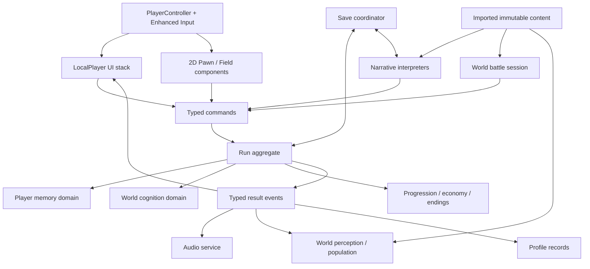

# Unreal Engine 5.7 architecture

Status: proposed architecture, no UE implementation in Phase 0. Behavior comes from the audited Godot checkout, not from a new RPG framework. Retain 2D top-down exploration, painterly battle compositions, VN/CG pacing, typography, and the memory-loss identity. No conversion to 3D character gameplay, no multiplayer or Gameplay Ability System dependency is justified by the current game.

## Ownership and lifetime

Use a small number of lifetime owners with domain objects underneath. Engine-managed subsystem lifetimes fit services that must survive travel or exist per world/player; they do not justify one subsystem per Autoload. [Epic subsystem documentation, 5.7](https://dev.epicgames.com/documentation/en-us/unreal-engine/programming-subsystems-in-unreal-engine?application_version=5.7).

| Proposed owner | Responsibility and state | Lifetime / technology / persistence |
| --- | --- | --- |
| `UMemoriaGameInstance` | Thin composition root and startup mode selection | Engine lifetime; C++; no second copy of run state |
| `UMemoriaRunSubsystem` | Active run aggregate; start/reset/import/export; player stats, inventory/equipment, chapter, flags, run statistics | GameInstance subsystem, C++; owns reflected/GC-tracked domain UObjects; explicit run SaveGame DTO |
| `UPlayerMemoryDomain` | Player memory instances, burn/cascade/erosion/residue/loan/guard/preservation rules | Run-owned UObject + pure C++ rules; first-class domain, immutable definitions; saved instances and history |
| `UWorldCognitionDomain` | Actor state, world revision/sequence, NPC memory tombstones and knowledge; registry validation | Separate run-owned UObject; C++ snapshot/commands; saved independently from player memory |
| `URunProgressionDomain` | Chapter effects, oaths, quests, equipment/economy, ending predicates | Run-owned C++ objects/structs; per-domain command APIs; flags/dynamic legacy fields retained |
| `UMemoriaNarrativeSubsystem` | Field and VN interpreters; continuation, choice processing, chapter/ending/travel requests | GameInstance subsystem C++; two typed interpreters over imported assets; serializable VN cursor; field line/UI state transient |
| `UMemoriaSaveSubsystem` | DTO validation, legacy JSON import, slots/backups, checkpoint policy, staged restore | GameInstance subsystem C++; `UMemoriaRunSaveGame`, explicit schemas and file adapter; no live actor pointers |
| `UMemoriaProfileSubsystem` | Achievements, codex, read-line IDs, seen endings, NG+/rush records | GameInstance subsystem C++; `UMemoriaProfileSaveGame`; preferences in settings/config adapter; separate from run import |
| `UMemoriaAudioSubsystem` | BGM A/B crossfade and ambient/layer routing across travel | GameInstance subsystem C++; audio components owned safely across worlds; volume settings persistent, playback handles transient |
| `UMemoriaWorldSubsystem` | Map population, encounter pacing, perception projection, gateways, objective/POI discovery | WorldSubsystem C++; per-map actor registry; authoritative persistent flags remain in run domain |
| `UMemoriaBattleWorldSubsystem` + `UBattleSession` | Battle command queue, turn state, current enemy, status/break/echo/directives, reward/cleanup protocol | Battle-world lifetime C++; session UObject; transit descriptor in RunSubsystem; no mid-battle save promised |
| `UMemoriaUISubsystem` | Modal stack, focus restoration, HUD, notifications, CG/backlog/menus | LocalPlayerSubsystem C++ controller/view models + UMG/Blueprint layouts; no ownership of gameplay state |
| `AMemoriaPlayerController` | Enhanced Input dispatch, cursor/device mode, interaction focus, camera intent | Local player/world; C++; input contexts and device glyph assets |
| `AMemoriaPawn` + `UMemoriaMovementComponent` | 2D movement, collision, foot sorting; flow/dash/pulse components | World-owned APawn, C++; only position and explicit run rewards survive; transient flow/cooldowns preserved as source resets |
| NPC/companion/threat/cache/gateway actors | Interactions, follow movement, overlapping triggers, visuals | C++ base/components, Blueprint configuration; stable authored IDs read run flags; no level Blueprint persistence |
| Exploration/Battle `AGameModeBase` | Spawn and mode setup rules | World lifetime; thin C++; do not store saves here |
| `AGameStateBase` | Optional observable current-mode presentation | No persistent authority or replication requirement; do not move chapter/memories into travel-destroyed GameState |
| Asset Manager / catalog assets | Immutable story, memories, enemies, population, galleries, sprite/material/audio profiles | PrimaryDataAssets; DataTables for flat rows; soft references and explicit cooked dependencies |

Names are proposed implementation names, not classes already present. [SYSTEM_MAP](SYSTEM_MAP.md) maps every source into these owners, with persistence, difficulty, and tests.

## State and event contract

Keep stable string IDs and original numeric grade values. `FMemoryDefinition` holds authored title/localization keys, grade, power, story effect, related NPC, source order. `FPlayerMemoryState` holds burned/faded/residue/erosion and identity. `FWorldActorState` separately holds addressable memories, facts, and extension bags. Preserve unknown legacy flag/extension keys through import; gradually type verified keys without destroying the remaining data.

All writes go through C++ commands returning explicit results and ordered effect records. Do not rely on Blueprint delegate subscription order for gameplay. Model source-observable phases explicitly: a residue-created notification can occur before burned history is complete; world cognition emits only after revision/sequence mutation; battle start, resolution, reward-ready, and cleanup are distinct events. An adapter may publish dynamic multicast delegates to Blueprint UI; C++ correctness uses typed delegates/results and explicit orchestration. Avoid one untyped global event bus.

Use initialization dependencies for subsystem construction, followed by an explicit `ContentReady → ProfileReady → RunReady → WorldReady` bootstrap. Godot's textual Autoload order is evidence of coupling, not an Unreal startup specification. Never query a world actor from a subsystem constructor. Detach subscriptions on widget deactivation/world teardown; each asynchronous operation carries run-generation and scene-generation tokens. Ignore stale animation/audio completion callbacks after load/new game/travel.

Battle commands resolve logical outcomes separately from paced presentation. Preserve the existing action order and integer truncation at each calculation stage; do not algebraically combine multipliers. Feed a recorded random-draw stream into cross-engine comparison tests. Equal RNG seeds alone cannot make Godot and Unreal sequences equal, especially where visual noise currently consumes the global random stream.

## 2D world and visual pipeline

Use Paper2D sprites/flipbooks and an orthographic camera. Paper2D imports and configures texture-backed sprites; the original images remain source assets. [Epic Paper2D sprite workflow, 5.7](https://dev.epicgames.com/documentation/unreal-engine/how-to-import-and-use-paper-2d-sprites-in-unreal-engine?application_version=5.7).

Choose a single gameplay plane: Unreal XY, camera along -Z, imported Godot `(x,y)` mapped to `(x,-y,0)`. Start with one source pixel = one Unreal unit; expose conversion in one adapter and test corners, foot pivots, interaction range, tile collision, and saved positions. Render components face the camera; separate small render-depth offsets from collision plane. Foot-based sorting must match overlapping NPCs/props, not depend on Unreal actor creation order. This is a coordinate convention, not a promise that default Paper2D orientation already matches it.

Use `APawn` with explicit accelerated movement and swept collision. Godot floating CharacterBody2D behavior, 120 px/s speed, sprint/turn braking, diagonal normalization, phase dash and interaction ray need direct measurement. Default walking `ACharacter` gravity/step-up/navmesh behavior adds unwanted semantics. A constrained custom movement component is the narrower fit.

Evaluate PaperTileMap rendering on the first map, but retain an engine-neutral grid IR with tile IDs, variants, collision, depth and placement. Import generated tiles into sprite atlases; use custom batched quad/chunk rendering only if measured Paper2D limitations prevent the existing blending/order/material result. Do not turn maps into 3D landscape or replace hand-authored collision with inferred image collision.

The Godot `.tscn` files are mostly shells: tile grids, art, collision, NPCs, triggers, gateways, and atmosphere are built in GDScript. Export that evaluated authoring data; converting `.tscn` nodes alone will produce empty maps. Preserve real-art sprite normalization and generated four-frame walk cycles, not just the fallback colored character.

Battle is a 2D composed stage with fixed information panels, portrait/actor animation, burn/witness cues and hit feedback. Implement UMG layout plus sprite/plane visual actors as appropriate. Existing decorative `HybridDepthStage` projections may be matched with a render target, or baked if equivalent under all existing camera/effect states; this decision must pass visual comparison. It does not authorize 3D exploration.

Recreate shader effects as Unreal sprite materials, UI-domain materials, and explicitly scoped post-process effects. World post-processing does not automatically cover UMG: choose which layers include CG/portraits/text, and use UI materials/Retainer rendering when necessary. Preserve alpha silhouettes, outline width, desaturation/absence afterglow, distortion, and low-motion/clean-visual semantics. Do not use bloom/lighting upgrades to alter the visual direction. See [ASSET_INVENTORY](ASSET_INVENTORY.md).

## Input, UI, narrative presentation

Enhanced Input provides actions and prioritized mapping contexts. Use separate Exploration, Battle, Narrative, and Modal contexts, with one owner deciding which consumes each command. [Epic Enhanced Input, 5.7](https://dev.epicgames.com/documentation/en-us/unreal-engine/enhanced-input-in-unreal-engine?application_version=5.7).

Create semantic actions for Move, Interact/Advance, Sprint, PhaseDash, MemoryPulse, QuickItem, Archive, Menu/Back, Journal, Compass, Backlog, QuickSave/Load, VN Auto and FastForward. Import the actual project key/button/axis mappings plus raw-handler keys; hints are not authoritative bindings. Preserve non-repeat handling and release-before-next-confirm to prevent the same Space/A/Esc event selecting a choice and closing the resulting overlay.

Use UMG with a C++ modal/focus controller first. CommonUI activatable widgets are appropriate if they pass keyboard/mouse/controller, pause, and nested-back tests. Do not make the optional CommonUI–Enhanced Input bridge a foundation dependency: Epic's [integration page](https://dev.epicgames.com/documentation/en-us/unreal-engine/using-commonui-with-enhnaced-input-in-unreal-engine) retains an experimental warning described as of 5.2, which is insufficient to certify a specific 5.7 integration. Validate against the installed 5.7 headers/sample behavior before enabling it.

Keep gameplay commands out of widgets. Archive, shop, constellation, codex and journal read view models; button handlers submit IDs, not copies of mutable memory objects. CG background presentation and blocking full-screen CG are separate modal policies. Pause suspends field/battle logic while pause/settings/backlog controls still work. VN resume reconstructs the widget from cursor/content state, not serialized widgets or delegates.

Use localized FText/String Tables with stable text IDs. Retain serif story text and sans-serif UI, correct Korean weight, line wrapping, choice bounds, and 1280×720 authored layout with a tested DPI policy. Do not show developer IDs or missing-text placeholders to players. An unsupported controller action is a recorded source gap; any expansion beyond baseline parity must be explicit.

## Persistence, audio, testing and module boundaries

`UMemoriaRunSaveGame` and `UMemoriaProfileSaveGame` are versioned DTO containers, not automatic serialization of the whole UObject graph. The save adapter validates all sections and content IDs before committing a new aggregate; then loads the world, restores position/continuation, and emits completion. Preserve Godot JSON as read-only import input, never overwrite it. Preserve the three manual slots, autosave slot, backup fallback and profile separation. Exact fields and migration cases are in [DATA_MIGRATION](DATA_MIGRATION.md).

Audio uses paired persistent AudioComponents for BGM crossfade, named SoundClasses/Submixes for music/SFX/ambient, and a centralized mix-state controller for dialogue ducking, low HP, void, combat intensity and burn silence. Import original tracks through a tested deterministic PCM conversion. Bake procedural one-shot SFX/transition stings from reference generation; implement genuinely variable layers as procedural synthesis/MetaSounds only where playback equivalence needs it. Preserve random/pitch/gain ranges and clipping/headroom; test both music players under options changes.

Start with `MemoriaRuntime`, `MemoriaEditor` (import factories/commandlets only), and `MemoriaTests`. Within Runtime use Domain, Narrative, World, Battle, Presentation, Persistence folders; avoid a plugin per tiny source class. Assets are data-only Blueprint children, typed DataAssets/Tables, materials, and UMG widgets. Core mutations/save/conditions/ending rules are C++. Level Blueprints should not contain irreplaceable story rules.

Validation layers: pure rules tests; golden Godot command/state/event traces; Unreal Automation tests; functional map/input/travel/save tests; packaged Windows content/load tests; paired visual/audio review. Each phase must publish evidence. A compiling editor or an Automation PASS line without successful process exit/fatal-log checks is insufficient. No UE layer has been implemented or certified yet.
