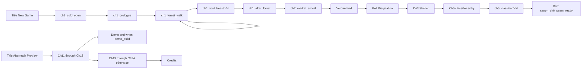
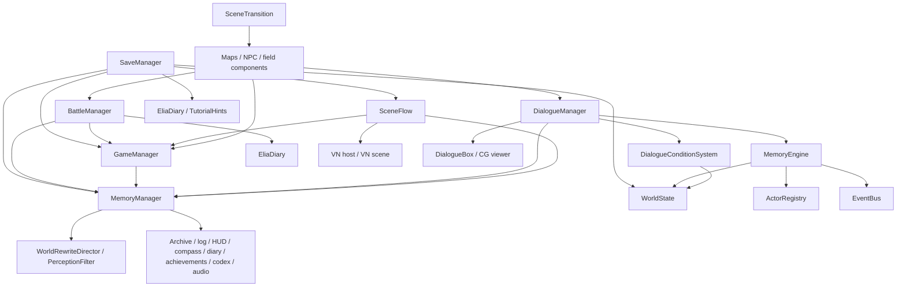

# Runtime system map and coding-agent handoff

Reference: Godot 4.6.2 working tree at `15df72809baa52eec281d8508f495a373e9f5884`, audited 2026-09-06. Read [AUDIT](AUDIT.md) for evidence limits. There are **77 first-party runtime scripts and 34 Autoloads**, not the older S54 list. The complete source/method index is [source_index.json](evidence/source_index.json). Use it to jump to methods rather than reread 65,905 lines.

## Start here

| Question | Source entry points |
| --- | --- |
| What starts a real New Game? | `scenes/main/main.gd::_on_new_game_pressed`, `scenes/main/vn_host.gd::_ready`, `SceneFlow.play` and Ch1 VN JSON |
| What changes player memories? | `MemoryManager.burn_memory`, `burn_memory_silent`, `apply_erosion`, `synthesize`, loan/extraction functions; inspect callers as well as API |
| What changes an NPC's knowledge? | `MemoryEngine` commands through `WorldState`, validated against `ActorRegistry`; `DialogueConditionSystem.evaluate` consumers |
| Why does a choice disappear or advance? | Field `DialogueManager._show_next_line/select_choice`; VN `SceneFlow._run_step/select_choice` and `vn_scene` choice renderer; they are different dialects |
| Why did a map/NPC change after loss? | `WorldRewriteDirector`, `PerceptionFilter`, NPC burn-reaction metadata, chapter map flags and `MemoryCompass` |
| What runs a battle? | `BattleManager.start_battle`, command/turn/cleanup functions; `battle_scene.gd` subscribes, animates and submits commands |
| What persists? | `SaveManager.save_game/load_game`, every domain `export_data/import_data`, and separate profile/settings writers |
| Where are maps and HUD nodes? | Mostly generated by `_ready/_build_*` GDScript, not the small `.tscn` files |
| What protects test saves? | `scripts/tools/run_memory_world_engine_smoke_suite.ps1`, shared smoke runner/path guards and five save fixtures; preserve fatal-scan and isolated-root rules |

Method names above are navigation hints; the indexed source is authoritative if names evolve. No Unreal files exist yet; proposed owner names refer to [ARCHITECTURE](ARCHITECTURE.md).

## Startup, routes and state

`project.godot` creates Autoloads in the order captured in [summary.json](evidence/summary.json). GameManager is first, before many systems it references during startup. Nodes, `_ready` completion, loaded profile and loaded content are not the same readiness state. Title and Options also apply/reset state. Startup therefore cannot be ported as independent singleton constructors.

Game mode enum: EXPLORATION, DIALOGUE, BATTLE, CUTSCENE, MENU, PAUSED. PauseMenu usually toggles `SceneTree.paused` without changing this enum. An exploration state alone is insufficient to decide whether input/timers should run.

Legacy map scripts retain the older ten-map route, encounters, bosses, endings and epilogue dialogues. Nine optional maps share `optional_memory_site.gd`. Availability uses explicit story gates, not merely chapter number; early optional sites remain in the repository even where no current gateway points to them. Do not infer that all present scenes belong on the New Game path. Scene filenames must remain recognized by legacy save import.

## Dependency graph

Arrows mean “calls/reads/feeds,” not exclusive ownership. The readable graph below highlights the mutation paths. [autoload_dependencies.mmd](evidence/autoload_dependencies.mmd) contains all 34 nodes and every first-party lexical Autoload-to-Autoload edge. [dependencies.csv](evidence/dependencies.csv) gives exact source lines, including non-Autoload callers. The mapping table later lists those dependencies per runtime file.

## Mutation and event contracts

| Producer / notifications | Consumers and order-sensitive meaning |
| --- | --- |
| GameManager `state_changed`, `stat_gained`, `field_focus_changed`, `inventory_changed` | HUD, menus, world and combat presentation. Direct dictionary writes are also common and do not guarantee an event. Treat dictionary access sites as dependencies. |
| MemoryManager `memory_added/burned/became_residue/faded/synthesized/extracted`, `memories_eroded`, `memory_cascaded` | GameManager story effects, audio, archive/HUD/log/toasts, diary, achievements/codex, world rewrite and compass. Normal residue can be emitted before burned-history insertion; synthesized inputs are removed, not burned. |
| MemoryManager `passive_unlocked`, `anchor_passive_unlocked`, `anchor_vigil_changed`, `memory_guarded`, `guard_slots_changed`, `loan_changed`, `carry_state_changed` | Preservation/archive/shop/field feedback. Carry and connections derive from authoritative memory data; do not save an independent capacity cache. |
| DialogueManager dialogue start/line/choice/end | DialogueBox, CG/audio, map/NPC continuation. Map callbacks may start the next dialogue immediately. Filtered choice indexing must match each interpreter. |
| SceneFlow `scene_started`, `step_changed`, `scene_ended` | VN renderer and continuation. Saved state contains IDs/indices/queue, not the emitted dictionary/widget. |
| BattleManager `battle_started`, turn start, `pre_attack`, `damage_dealt`, `status_changed`, `item_used` | Battle UI/VFX/audio, GameManager stats, SaveManager boss checkpoint and Codex. Start listeners can run before complete encounter setup. |
| BattleManager combo/ally/phase/telegraph/scan/witness/break/objective/momentum/entry/echo/stance/environment/limit/focus/last-stand events | Presentation and outcome feedback; see [signals.csv](evidence/signals.csv) for exact names. Do not implement secondary combat only as widgets. |
| BattleManager `battle_ended` → `victory_rewards_ready` → `battle_cleanup_finished` | End statistics and listeners precede reward calculation; rewards UI dismisses or times out; boss-rush advances only after cleanup. Enemy data must remain available during end listeners. |
| SaveManager `save_completed/load_completed/save_failed/autosave_completed` | Toast/indicator/UI feedback. Current Godot load notification is earlier than transition completion; target UE distinguishes state accepted and world ready. |
| EventBus `world_event_committed` | Validated copied world mutation event; exactly schema_version/event_id/event_type/event_sequence/revision/actor_id/target_id/payload. Five types: memory.added/removed/restored and knowledge.learned/forgotten. No-op produces none. No stored event log or deduplication service. |

## Domain details that are easy to miss

- Player memory graph links same-NPC entries and adjacent same-prefix entries in source insertion order. Burn/fade/extract/collateral are not interchangeable states. Zero/core rank remains integer 4. Erosion uses `max(1, round(chapter * (1 + clamp(overload,0,1))))`, then source-order Elia/rank multipliers with integer truncation; grade 4 is immune, faded/burned entries skipped, fade at integer 70% of power.
- Carry weights `[1,2,3,4,6]`, capacity cap 34; collateral/burned excluded. Loan principals `[14,26,44,70,0]`, repayment rounded ×1.4, due chapter+2 with extraction only after due. Guards have two slots; prices `[8,14,22,34,50]`. Synthesis preserves its exact two-input formula and identity generation, including collision risk.
- World cognition has four catalog actors. Restore retains removed/restored revisions. Knowledge missing vs false is retained in storage, although Boolean conditions can read both as false. Actor/fact/memory ID namespaces and source actor metadata are part of save compatibility.
- Journey oaths are not mutually exclusive in current code. Ash breaks on sale; Witness on visible-threat bypass; Still on voluntary Elia-linked burn, with forced VN step burns excluded. Chapter rewards/kept state live in GameManager flags/player_data.
- FieldFlow is a player child, not persistent global energy: starts at 24/100, phase cost 42, duration .22s, cooldown .54s, multiplier 2.45. Entry priorities and witness windows feed battle; random encounters and visible threats have separate pacing. FieldThreat marks its defeated flag before combat resolution, a compatibility case to characterize on defeat/retry.
- Battle is one enemy plus party capabilities. Keep ordinary attacks, stances, burn/chain/residue/limit, witness, break/momentum, directives, equipment/items, passives/echoes, environment/modifiers, statuses/AI/phase, ally commands, auto and rush. Normal void attack damage is reduced rather than universally immune. Auto can burn valuable memories. A witness victory still passes through shared defeat/statistics processing.
- Perception uses scene metadata/groups, collision disabling, NPC dialogue replacement and once-only burn reactions. World rewrite adds flags, echo clusters, art and absence afterglow. Compass independently refreshes some perception; it is not a waypoint system. Constellation is read-only.
- Options have much more than volume/fullscreen: text speed, difficulty, locale, resolution, dialogue size, high contrast, colorblind mode, shake, reduce motion, clean visuals, auto narration, quality, VSync/FPS, battle speed and read-only skip. Defaults favor clean visuals/reduced motion; preserve actual branches.
- SFX/ambience/stings are generated PCM; eight runtime music MP3s have source/reference counterparts under `mugic`. Four VFX Library shaders are active although its editor plugin is disabled. Rendered content cannot be found only by enumerating `.tscn` nodes and `assets/audio`.

## Per-source ownership and migration table

Each row covers a first-party runtime implementation. Dependencies are lexical Autoload references excluding comment-only lines; they can include guarded/dead code and must be interpreted with the preceding lifecycle notes. “Save” states the authoritative section or explicitly transient state. Difficulty: H = multiple coupled contracts or engine-specific rendering; M = bounded reimplementation; L = small data/presentation adapter. Test IDs resolve in [PARITY_MATRIX](PARITY_MATRIX.md). “DA/DT” means DataAsset/DataTable; “UI” means the LocalPlayer UI owner; all destinations are proposed.

| Godot source | Responsibility | Autoload dependencies | State owned | Unreal destination / technology | Save requirements | Difficulty | Validation |
| --- | --- | --- | --- | --- | --- | --- | --- |
| [scenes/battle/battle_scene.gd](../../scenes/battle/battle_scene.gd) | Battle layout, actor motion, burn confirmation, forecasts, rewards | GameManager, MemoryManager, BattleManager, AudioManager, OptionsMenu, EliaDiary, TutorialHints, WorldRewriteDirector | UI nodes, tween/VFX handles and selection | UI battle presenter + world visual actors; C++/UMG/BP/materials | Transient; commands mutate BattleSession/run | H | P22-P29,P45 |
| [scenes/main/main.gd](../../scenes/main/main.gd) | Title, new run, load, previews, NG+/rush/gallery entry | GameManager, MemoryManager, WorldState, SceneTransition, SaveManager, AudioManager, OptionsMenu, SceneFlow | Menu animation and reset orchestration | UI title widget + Run/Profile command facade; C++/UMG | Profile unlocks; reset run via coordinator | H | P01,P02,P30,P42 |
| [scenes/main/vn_host.gd](../../scenes/main/vn_host.gd) | Rebuild VN renderer and consume pending continuation | SceneFlow | Hosted renderer lifetime | Narrative host actor + UI controller; C++/BP | Continuation in scene_flow, host transient | M | P08,P38,P43 |
| [scenes/maps/belt_waystation.gd](../../scenes/maps/belt_waystation.gd) | Ch3 Tobias/white-paper canon gates and optional routes | GameManager, MemoryManager, DialogueManager, SceneTransition, BattleManager, SaveManager, AudioManager, NotificationToast, AchievementManager | Grid/spawn/trigger dictionaries, local guards and scene nodes | World map factory + C++ story trigger components; BP/Map DA | game/world/memory flags and position; local nodes rebuilt | H | P03-P04,P16-P18,P21,P33,P41-P42 |
| [scenes/maps/bl07_void.gd](../../scenes/maps/bl07_void.gd) | Legacy void/Seal decisions/endings/epilogue routing | GameManager, MemoryManager, DialogueManager, SceneTransition, BattleManager, SaveManager, AudioManager, NotificationToast, AchievementManager | Grid/spawn/trigger dictionaries, local guards and scene nodes | World map factory + C++ story trigger components; BP/Map DA | game/world/memory flags and position; local nodes rebuilt | H | P03-P04,P16-P18,P21,P33,P41-P42 |
| [scenes/maps/colorless_waste.gd](../../scenes/maps/colorless_waste.gd) | Legacy waste/Kairos boss and late-route transitions | GameManager, MemoryManager, DialogueManager, SceneTransition, BattleManager, SaveManager, AudioManager, NotificationToast, AchievementManager | Grid/spawn/trigger dictionaries, local guards and scene nodes | World map factory + C++ story trigger components; BP/Map DA | game/world/memory flags and position; local nodes rebuilt | H | P03-P04,P16-P18,P21,P33,P41-P42 |
| [scenes/maps/crumbling_coast.gd](../../scenes/maps/crumbling_coast.gd) | Legacy coast route, separation/Kairos observations and transition | GameManager, MemoryManager, DialogueManager, SceneTransition, BattleManager, SaveManager, AudioManager, NotificationToast, AchievementManager | Grid/spawn/trigger dictionaries, local guards and scene nodes | World map factory + C++ story trigger components; BP/Map DA | game/world/memory flags and position; local nodes rebuilt | H | P03-P04,P16-P18,P21,P33,P41-P42 |
| [scenes/maps/drift_shelter.gd](../../scenes/maps/drift_shelter.gd) | Ch4 shelter/anchoring/party, Ch5 entry and post-classifier Ch6-ready boundary | GameManager, MemoryManager, DialogueManager, SceneTransition, BattleManager, SaveManager, AudioManager, NotificationToast, StoryJournal, AchievementManager | Grid/spawn/trigger dictionaries, local guards and scene nodes | World map factory + C++ story trigger components; BP/Map DA | game/world/memory flags and position; local nodes rebuilt | H | P03-P04,P16-P18,P21,P33,P41-P42 |
| [scenes/maps/forgotten_forest.gd](../../scenes/maps/forgotten_forest.gd) | Legacy memory-parasitic forest and branching encounters/events | GameManager, MemoryManager, DialogueManager, SceneTransition, BattleManager, SaveManager, AudioManager, NotificationToast, AchievementManager | Grid/spawn/trigger dictionaries, local guards and scene nodes | World map factory + C++ story trigger components; BP/Map DA | game/world/memory flags and position; local nodes rebuilt | H | P03-P04,P16-P18,P21,P33,P41-P42 |
| [scenes/maps/optional_memory_site.gd](../../scenes/maps/optional_memory_site.gd) | Nine configured optional exploration pockets and origin return | GameManager, SaveManager, NotificationToast, AchievementManager | Grid/spawn/trigger dictionaries, local guards and scene nodes | World map factory + C++ story trigger components; BP/Map DA | game/world/memory flags and position; local nodes rebuilt | H | P03-P04,P16-P18,P21,P33,P41-P42 |
| [scenes/maps/rim_forest.gd](../../scenes/maps/rim_forest.gd) | Legacy Ch1 forest, story triggers and current disabled setup calls | GameManager, DialogueManager, SceneTransition, BattleManager, SaveManager, CgViewer, AudioManager, OptionsMenu, NotificationToast, AchievementManager, SceneFlow | Grid/spawn/trigger dictionaries, local guards and scene nodes | World map factory + C++ story trigger components; BP/Map DA | game/world/memory flags and position; local nodes rebuilt | H | P03-P04,P16-P18,P21,P33,P41-P42 |
| [scenes/maps/seam_outskirts.gd](../../scenes/maps/seam_outskirts.gd) | Legacy outskirts trials/echo-shell and story triggers | GameManager, MemoryManager, WorldState, MemoryEngine, DialogueManager, SceneTransition, BattleManager, SaveManager, AudioManager, NotificationToast, StoryJournal, AchievementManager | Grid/spawn/trigger dictionaries, local guards and scene nodes | World map factory + C++ story trigger components; BP/Map DA | game/world/memory flags and position; local nodes rebuilt | H | P03-P04,P16-P18,P21,P33,P41-P42 |
| [scenes/maps/the_seam.gd](../../scenes/maps/the_seam.gd) | Legacy Seam route, Sable/boss and downstream flags | GameManager, MemoryManager, DialogueManager, SceneTransition, BattleManager, SaveManager, AudioManager, NotificationToast, AchievementManager, MemoryPuzzle | Grid/spawn/trigger dictionaries, local guards and scene nodes | World map factory + C++ story trigger components; BP/Map DA | game/world/memory flags and position; local nodes rebuilt | H | P03-P04,P16-P18,P21,P33,P41-P42 |
| [scenes/maps/verdan_market.gd](../../scenes/maps/verdan_market.gd) | Ch2 market arrival/Malet trade and cognition, revisit encounter/puzzle gates | GameManager, MemoryManager, WorldState, MemoryEngine, DialogueManager, SceneTransition, SaveManager, AudioManager, OptionsMenu, NotificationToast, MemoryShop, AchievementManager, MemoryPuzzle | Grid/spawn/trigger dictionaries, local guards and scene nodes | World map factory + C++ story trigger components; BP/Map DA | game/world/memory flags and position; local nodes rebuilt | H | P03-P04,P16-P18,P21,P33,P41-P42 |
| [scenes/story/ch5_classifier_entry.gd](../../scenes/story/ch5_classifier_entry.gd) | Record Malet report once and launch classifier VN | GameManager, WorldState, MemoryEngine, SceneTransition, SaveManager, SceneFlow | Entry guards and projected report flags | Narrative entry component; C++ + story DA | World facts/game flags, not widget state | H | P16,P42 |
| [scenes/ui/credits.gd](../../scenes/ui/credits.gd) | Scroll localized credits, ending achievement and title return | GameManager, MemoryManager, SceneTransition, AudioManager, AchievementManager | Scroll/finish state | Credits UMG + progression/profile commands | Ending records in profile/run; scroll transient | M | P41,P43 |
| [scenes/ui/game_over.gd](../../scenes/ui/game_over.gd) | Retry, save load and title recovery | GameManager, SceneTransition, BattleManager, SaveManager, AudioManager | Return map and controls | UI game-over controller + Save/Travel facade | Retry descriptor/checkpoint, no battle widget save | M | P28,P39 |
| [scenes/ui/options_menu.gd](../../scenes/ui/options_menu.gd) | Preferences, accessibility, pacing and display application | GameManager, DialogueBox, AudioManager, OptionsMenu | Settings dict and live controls | Settings adapter + UMG, Audio/UI services; C++ | settings.json compatibility + config; locale precedence | H | P05,P06,P44,P45 |
| [scripts/core/companion.gd](../../scripts/core/companion.gd) | Party follower, formation/trail/warp, interaction | GameManager, DialogueManager | Positions, trail, timers, animation | Companion actor/movement component; C++/BP | Party flags in run; trail transient | M | P04,P48 |
| [scripts/core/game_manager.gd](../../scripts/core/game_manager.gd) | Run state, player/economy/equipment, progression/endings, NG+/rush | MemoryManager, WorldState, SceneTransition, BattleManager, NotificationToast, AchievementManager, TutorialHints | player_data, flags, chapter, equipment/upgrades, stats, profile records | Run/Progression/Profile domains; C++/DA/DT | game section plus separate profile files | H | P01,P30-P33,P40-P41 |
| [scripts/core/npc.gd](../../scripts/core/npc.gd) | Interactable dialogue selection, repeat/burn reaction and schedule | GameManager, DialogueManager | Nearby player, talked cache, dialogue key and sprite | NPC actor + interaction/condition components; C++/BP | Talked/reaction flags in game; cached nodes transient | H | P04,P07,P18 |
| [scripts/core/player.gd](../../scripts/core/player.gd) | Movement/collision, ray interaction, camera, sprint/dash/pulse | GameManager, BattleManager, AudioManager, OptionsMenu, NotificationToast, TutorialHints, InputManager | Velocity/facing, camera, input, pulse/flow state | APawn + movement/field/camera components; C++/Paper2D | Position in run save; most motion transient | H | P03-P06,P20-P21 |
| [scripts/core/scene_transition.gd](../../scripts/core/scene_transition.gd) | Guarded map travel, styled wipes, chapter cards, stings | GameManager | Transition lock, old mode, tween/overlay handles | Travel coordinator + UI transition presenter + Audio; C++/UMG/BP | Map ID in save; in-progress travel transient | H | P28,P38-P39,P42,P48 |
| [scripts/effects/ash_rain.gd](../../scripts/effects/ash_rain.gd) | Ash weather particle construction | OptionsMenu | Particles/materials | World visual component; BP/materials/Niagara as needed | Transient, scene-config data only | M | P45 |
| [scripts/systems/actor_registry.gd](../../scripts/systems/actor_registry.gd) | Validate and expose immutable actor catalog | None found; local/resource dependencies | Validated catalog and errors | WorldCognition catalog repository; C++/DT | Catalog version referenced; no mutable run copy | M | P15,P46-P47 |
| [scripts/systems/audio_manager.gd](../../scripts/systems/audio_manager.gd) | Music crossfades, procedural SFX/layers, duck/filter/mix | None found; local/resource dependencies | Audio players, generated samples, mix state | Audio GI subsystem + SoundWave/Submix; C++ | Preferences saved; stream/timers transient | H | P44,P48 |
| [scripts/systems/battle_manager.gd](../../scripts/systems/battle_manager.gd) | Combat commands/AI/turns/status/echo/witness/directives/rewards | GameManager, MemoryManager, SceneTransition, AudioManager, OptionsMenu, NotificationToast, AchievementManager, Codex, EliaDiary, TutorialHints, InputManager, WorldRewriteDirector | Enemy/session/turn, limit/combo/momentum, pending field entry | BattleWorldSubsystem + BattleSession/rule objects; C++/DA | Outcomes in run/profile; current fight not serialized | H | P22-P30,P48 |
| [scripts/systems/battle_vfx.gd](../../scripts/systems/battle_vfx.gd) | Transient particles, hit/critical/burn screen presentation | GameManager, BattleManager, OptionsMenu | Scene references and spawned effect handles | Battle visual component/presenter; C++/BP/materials | None | H | P24-P25,P45,P48 |
| [scripts/systems/dialogue_condition_system.gd](../../scripts/systems/dialogue_condition_system.gd) | Recursive world memory/knowledge predicates | WorldState, MemoryEngine | No independent mutable state | Typed condition evaluator; pure C++ | Authored conditions in story DA | M | P07,P15-P17 |
| [scripts/systems/dialogue_manager.gd](../../scripts/systems/dialogue_manager.gd) | Field dialogue interpreter and world mutations | GameManager, MemoryManager, MemoryEngine, DialogueConditionSystem, NotificationToast, StoryLog | Cache, current array/index/filtered choices | Narrative field interpreter; C++ + dialogue DA | Field UI not serialized; effects in run/world | H | P07,P16-P17 |
| [scripts/systems/event_bus.gd](../../scripts/systems/event_bus.gd) | Validate and publish copied world events | None found; local/resource dependencies | No durable event log | WorldCognition typed delegates/event schema; C++ | Sequence owned by world snapshot, not bus | M | P15-P17 |
| [scripts/systems/field_flow.gd](../../scripts/systems/field_flow.gd) | Travel-based flow, phase dash and entry mode | GameManager | Flow/pressure/windows/cooldown/entry context | Pawn FieldFlowComponent; C++ | Transient except awarded run focus/flags | H | P20-P21,P27 |
| [scripts/systems/field_threat.gd](../../scripts/systems/field_threat.gd) | Visible hostile patrol/overlap, phase bypass, battle trigger | GameManager, SceneTransition, BattleManager, AudioManager, NotificationToast | Patrol/overlap and authored hostile record | Threat actor/component; C++/BP + enemy DA | Defeated/bypassed game flags; patrol transient | H | P20-P21,P28,P33 |
| [scripts/systems/input_manager.gd](../../scripts/systems/input_manager.gd) | Device detection/glyph/rumble and quick field recovery | GameManager | Current device mode, vibration | PlayerController + Enhanced Input + UI hints; C++/DA | No device state save; gameplay recovery in run | M | P05-P06,P31 |
| [scripts/systems/memory_engine.gd](../../scripts/systems/memory_engine.gd) | Actor memory add/remove/restore and fact learn/forget | EventBus, ActorRegistry, WorldState | Mutation orchestration over WorldState | WorldCognition command service; C++ | world_state section; never PlayerMemory burn | H | P15-P17,P37 |
| [scripts/systems/memory_manager.gd](../../scripts/systems/memory_manager.gd) | Burn/residue/cascade/erosion, carry, synthesis, loans/guards/vigil | GameManager, SystemLog, AudioManager, NotificationToast | Memory instances/history/loan/passives/guards | PlayerMemoryDomain; C++ + ordered memory DA | memory section; carry/graph derived | H | P09-P14,P19,P32,P37 |
| [scripts/systems/perception_filter.gd](../../scripts/systems/perception_filter.gd) | Memory-gated visibility/collision/dialogue and reactions | GameManager, MemoryManager, DialogueManager | Mutated scene nodes; no private snapshot | World projection/interaction components; C++/BP metadata | Reaction flags in game; scene projection rebuilt | H | P18,P33 |
| [scripts/systems/save_manager.gd](../../scripts/systems/save_manager.gd) | Slots/autosave/backup/migration/test-path guards and indicator | GameManager, MemoryManager, WorldState, SceneTransition, BattleManager, NotificationToast, Codex, EliaDiary, TutorialHints, SceneFlow | Checkpoint timers, restored position, save root | Save GI subsystem + UI indicator; C++/SaveGame | Versioned run DTO and read-only legacy JSON adapter | H | P37-P40,P46 |
| [scripts/systems/scene_flow.gd](../../scripts/systems/scene_flow.gd) | VN interpreter, continuations, route/ending/checkpoint actions | GameManager, MemoryManager, SceneTransition, SaveManager, AudioManager, NotificationToast, AchievementManager, StoryLog | IDs/indices/queue/ledger snapshot/cache | Narrative VN interpreter; C++ + story DA | scene_flow cursor; cache/renderer transient | H | P08,P38,P41-P43 |
| [scripts/systems/world_rewrite_director.gd](../../scripts/systems/world_rewrite_director.gd) | Loss reports, story flags, afterglow/revisit manifestations | GameManager, MemoryManager, NotificationToast | Transient art/echo nodes and latest scene tracking | Progression consequence rules + World/UI presenters; C++/DA/BP | Loss/revisit flags in game; reports derived from memories | H | P18-P19,P45 |
| [scripts/systems/world_state.gd](../../scripts/systems/world_state.gd) | Canonical actor snapshot, defaults/normalization and revision | ActorRegistry | Actor memories/facts/extension bags/world flags/quest states | WorldCognitionDomain; C++ | world_state schema 1, explicit import/export | H | P15-P17,P37 |
| [scripts/ui/achievement_manager.gd](../../scripts/ui/achievement_manager.gd) | Unlock predicates/stat tracking and achievement viewer | GameManager, MemoryManager, BattleManager, AudioManager, InputManager | Unlock/stat profile and widget | Profile achievement rules + UMG; C++/DA | achievements.json profile; Steam stub separate | M | P30,P36,P41 |
| [scripts/ui/cg_viewer.gd](../../scripts/ui/cg_viewer.gd) | Background and blocking CG, fades/text/input | GameManager, DialogueManager, InputManager | Texture/overlay/tween and blocking state | UI CG presenter; C++/UMG/materials/DA | No animation save; reconstruct from narrative | H | P05,P43,P45 |
| [scripts/ui/codex.gd](../../scripts/ui/codex.gd) | Bestiary/scan/memory archive, persistence and UI | GameManager, MemoryManager, BattleManager, AudioManager, ExplorationHUD | Display-name keyed enemy records, memory collection | Profile collection domain + UMG; C++/DA | codex.json with name/asset aliases | H | P22,P26,P36 |
| [scripts/ui/demo_end.gd](../../scripts/ui/demo_end.gd) | Demo completion screen and store/title action | GameManager, MemoryManager, SceneTransition, AudioManager | Overlay animation and placeholder Steam URL | UMG completion screen + configured external action | No independent run data | L | P42,P46 |
| [scripts/ui/dialogue_box.gd](../../scripts/ui/dialogue_box.gd) | Field text, choices, portraits, tags and read recording | GameManager, DialogueManager, CgViewer, AudioManager, OptionsMenu, NotificationToast, InputManager, SceneFlow, StoryLog | Typing/choice widget/portrait/modal state | Field dialogue UMG presenter; C++/BP | Effects in domain; read registry profile | H | P05,P07,P43,P45 |
| [scripts/ui/elia_diary.gd](../../scripts/ui/elia_diary.gd) | Diary unlock/read and four battle skill cooldowns | GameManager, MemoryManager, NotificationToast | Entries/read flags/skill cooldowns | Run guide/ally-skill domain + UI; C++/DA | elia_diary; import currently merges | M | P25,P35,P40 |
| [scripts/ui/exploration_hud.gd](../../scripts/ui/exploration_hud.gd) | HP/chapter/memory/grains/items/objective/field-flow display | GameManager, MemoryManager, BattleManager, AudioManager, OptionsMenu, InputManager | UI caches and timers | UI exploration view model + UMG | Derived, no own save | H | P20,P27,P35,P45 |
| [scripts/ui/memory_compass.gd](../../scripts/ui/memory_compass.gd) | Atmospheric memory density needle and loss pulse | GameManager, MemoryManager, OptionsMenu, WorldRewriteDirector | Needle/visibility/scene/current density | UI compass view model + world effect adapter; C++/UMG | Derived memory state; manual hide transient | M | P18-P19,P45 |
| [scripts/ui/memory_constellation.gd](../../scripts/ui/memory_constellation.gd) | Read-only graph layout and hover details | GameManager, MemoryManager, MemoryUI, AudioManager | Node positions/hover/previous archive visibility | Archive graph UMG/Slate view; C++/DA | None; stable legacy layout/hash adapter if needed | M | P19,P45 |
| [scripts/ui/memory_puzzle.gd](../../scripts/ui/memory_puzzle.gd) | Pair-matching board and attempt-based rewards | GameManager, MemoryManager, AudioManager, NotificationToast, AchievementManager | Cards/flips/attempts/timers | Run minigame session + UMG; C++ | Board transient; grains in run | M | P34,P48 |
| [scripts/ui/memory_shop.gd](../../scripts/ui/memory_shop.gd) | Memory/items/equipment/upgrade/loan transactions and UI | GameManager, MemoryManager, AudioManager, NotificationToast, AchievementManager, TutorialHints | Merchant stock dict/tab/selection | Economy commands + shop UMG + catalog DA/DT | Currency/items/memories/loan in run; sold stock transient | H | P09,P13-P14,P31 |
| [scripts/ui/memory_ui.gd](../../scripts/ui/memory_ui.gd) | Archive filters/detail, preservation/loan/carry controls | GameManager, MemoryManager, AudioManager, SceneFlow, MemoryConstellation, WorldRewriteDirector | Tabs/filter/selected memory/modal widgets | PlayerMemory view models + UMG; C++/DA | Domain data saved; selected view transient | H | P09-P14,P19,P45 |
| [scripts/ui/minimap.gd](../../scripts/ui/minimap.gd) | Runtime grid image, player/POIs/objective overlay | GameManager | Map texture/node references | World POI provider + UMG minimap; C++/BP | Derived from map/flags; no independent fog save | M | P33,P35 |
| [scripts/ui/notification_toast.gd](../../scripts/ui/notification_toast.gd) | Queued acquisition/burn/save feedback | GameManager, MemoryManager, SaveManager | Queue/current toast/tween | UI notification presenter; C++/UMG | None; unreachable old branches not port targets | L | P05,P09,P39,P48 |
| [scripts/ui/pause_menu.gd](../../scripts/ui/pause_menu.gd) | Pause/save/load/inventory/atlas/journal/gallery/oath navigation | GameManager, MemoryManager, SceneTransition, MemoryUI, SaveManager, AudioManager, OptionsMenu, NotificationToast, StoryJournal, AchievementManager, Codex, InputManager, SceneFlow, WorldRewriteDirector, StoryLog | Tree pause state, nested overlays and focus | UI modal controller + UMG screens; C++/BP | Commands affect domains; menu state transient | H | P05,P30-P33,P35,P39 |
| [scripts/ui/story_journal.gd](../../scripts/ui/story_journal.gd) | Derived story/NPC/choice/quest/lead/loss archive | GameManager, MemoryManager, AudioManager, ExplorationHUD, WorldRewriteDirector | Open tab/UI cache | Progression read model + UMG; C++ | Derived from game/memory/world, no separate save | M | P18,P33,P35 |
| [scripts/ui/story_log.gd](../../scripts/ui/story_log.gd) | Backlog/choice history, read-only skip registry | GameManager, AudioManager, OptionsMenu | 300-entry session log, 8000 read keys, pause restoration | UI backlog + Profile read-history domain; C++/UMG | read_lines.json hashes migrate; backlog transient | H | P05,P38,P43 |
| [scripts/ui/system_log.gd](../../scripts/ui/system_log.gd) | Queued administrative burn-detection popup | MemoryManager | Display queue and raw-rank presentation | UI notification channel; C++/UMG | None | L | P09-P10,P45 |
| [scripts/ui/tutorial_hints.gd](../../scripts/ui/tutorial_hints.gd) | First-event contextual hints and dismissals | GameManager | Shown IDs/current popup | Run guide state + UMG; C++/DA | tutorial_hints shown IDs; popup transient | M | P05-P06,P35 |
| [scripts/ui/vn_scene.gd](../../scripts/ui/vn_scene.gd) | VN stage/text/choices/typewriter/auto/skip/backlog | GameManager, MemoryManager, DialogueBox, AudioManager, OptionsMenu, SceneFlow, StoryLog | Renderer/timers/selected original choice index | VN UMG presenter + Narrative facade; C++/BP | No widget save; SceneFlow/read registry own persistence | H | P02,P05,P08,P38,P43 |
| [scripts/utils/encounter_modifiers.gd](../../scripts/utils/encounter_modifiers.gd) | Burn-dependent encounter variants and combat modifiers | MemoryManager, BattleManager | Static modifier definitions | Encounter rule helpers + DA; C++ | Selected session modifier transient | M | P21-P25 |
| [scripts/utils/field_actor_visuals.gd](../../scripts/utils/field_actor_visuals.gd) | World actor sprite framing/finish and presentation helpers | None found; local/resource dependencies | Generated visual nodes/material configuration | Actor visual component + sprite profiles; C++/BP | No mutable persistence | M | P04,P20,P45 |
| [scripts/utils/hybrid_depth_stage.gd](../../scripts/utils/hybrid_depth_stage.gd) | Decorative 3D SubViewport stages inside 2D presentation | GameManager, OptionsMenu | Viewport/camera/mesh/materials and motion | Optional decorative render-target presenter or approved bake; C++/BP/materials | None | H | P45,P48 |
| [scripts/utils/journey_oath.gd](../../scripts/utils/journey_oath.gd) | Ash/Witness/Still oath predicates, break and chapter rewards | GameManager, MemoryManager, NotificationToast | Uses game flags/player_data, no isolated store | Progression oath domain; C++/DA | game flags and oath_chapters_kept fields | H | P12,P20,P31-P32 |
| [scripts/utils/map_effects.gd](../../scripts/utils/map_effects.gd) | Lighting/weather/parallax/color/particles/lens/burn atmosphere | GameManager, MemoryManager, AudioManager, OptionsMenu, NotificationToast | World visual nodes/material cache/timers | World visual components and material profiles; C++/BP | Configuration assets; effects transient | H | P18,P45,P48 |
| [scripts/utils/map_gateway.gd](../../scripts/utils/map_gateway.gd) | Interactable scene gateway with localized prompt | GameManager, SceneTransition, NotificationToast | Destination/label and player overlap | Gateway actor + travel command; C++/BP | Map progress flags external; overlap transient | M | P04,P33,P42 |
| [scripts/utils/memory_resonance.gd](../../scripts/utils/memory_resonance.gd) | Authored memory-sensitive exploration sites and rewards | GameManager, MemoryManager, CgViewer, AudioManager, NotificationToast | Site state/proximity and local visuals | Resonance actor/rules + DA; C++/BP | Once/reward flags and memory effects in run | H | P09,P18,P33 |
| [scripts/utils/pixel_sprite.gd](../../scripts/utils/pixel_sprite.gd) | Real-art lookup, normalization, procedural fallback/walk/battle images | OptionsMenu | Generated texture/frame caches | Editor sprite bake/import + runtime flipbook profiles; C++/Paper2D | No mutable save; stable asset manifest | H | P03,P45-P47 |
| [scripts/utils/random_encounter.gd](../../scripts/utils/random_encounter.gd) | Distance threshold/pool/warning/phase suppression | GameManager, SceneTransition, BattleManager, NotificationToast | Per-map distance/RNG/warning/player previous pos | World encounter director; C++/DA | Transient counters; outcomes in run | H | P20-P21,P28 |
| [scripts/utils/side_quest.gd](../../scripts/utils/side_quest.gd) | Flag-driven authored quest stages and rewards | GameManager, MemoryManager, NotificationToast, AchievementManager | Static quest table; reads/writes game flags | Progression quest domain + DA; C++ | game flags/memory rewards, no widget save | M | P33,P35 |
| [scripts/utils/tile_painter.gd](../../scripts/utils/tile_painter.gd) | Procedural tile variants/grid/collision and scene art layers | OptionsMenu | Generated image/cache/map nodes | Editor grid/tile export + Paper2D/chunk renderer; C++/DA | Immutable map assets; no collider serialization | H | P03,P33,P45-P47 |
| [scripts/utils/ui_theme.gd](../../scripts/utils/ui_theme.gd) | Palette/type/spacing/styles and font weight factories | None found; local/resource dependencies | Static constants/font resources | Slate/UMG theme DA + composite fonts; C++ | Settings select variants; no domain save | M | P05,P43,P45 |
| [scripts/utils/world_atlas.gd](../../scripts/utils/world_atlas.gd) | Chapter-gated optional gateway definitions/spawn | GameManager | Static gate table and root spawn guard | Map content DA + World gateway factory; C++/BP | Gate availability from game flags | M | P33,P42 |
| [scripts/utils/world_cache.gd](../../scripts/utils/world_cache.gd) | Interactable cache reward and consumed presentation | GameManager, AudioManager | Cache record/collected state | Cache actor + economy command; C++/BP | Collected flags and rewards in run | M | P31,P33 |
| [scripts/utils/world_curio.gd](../../scripts/utils/world_curio.gd) | Lore/art/consumable curio interactions | GameManager, AudioManager, NotificationToast | Curio definition/used and visual state | Curio actor + progression command; C++/BP/DA | Once flags/items in run | M | P33,P43 |
| [scripts/utils/world_population.gd](../../scripts/utils/world_population.gd) | Map voices/hostiles/caches/curios and visual overrides | GameManager | Static catalog + spawned counts/root guard | Map population DA + World factory; C++/BP | Persistent identity via game flags, actors transient | H | P04,P20-P21,P33,P47 |

## Dialogic and tooling

The 34th runtime registration, `Dialogic`, resolves `uid://ds2q0uclmolvu` to `addons/dialogic/Core/DialogicGameHandler.gd`. It owns vendor timeline state but no first-party story use was found by reference search. Its future destination is **none unless a real content dependency is discovered**; preserve vendor files in the Godot reference. Difficulty L to omit from a new project after dependency/cook checks, not L to port the vendor framework. Validation: P46 plus searches for newly introduced timeline resources/calls.

The other 109 GDScript files are tools/tests, not shipping gameplay classes. They are indexed with methods in [source_index.json](evidence/source_index.json). Python validation, PowerShell smoke/export tooling, build docs and Godot CI remain reference infrastructure. Reuse fixture data and expected contracts in Unreal Automation; engine harnesses/capture scripts require new adapters rather than literal translation. Developer-only synthetic fixtures must never share production save/profile paths.

## Scene inventory

All `.tscn` files under `scenes/` are listed below. A low node count indicates runtime construction, not an empty feature. Keep each source path as a legacy import alias; player/NPC/UI resources become classes/widgets rather than separate travel maps where appropriate.

| Scene path / legacy alias | Nodes in file | Attached script(s) | UE role |
| --- | --- | --- | --- |
| [scenes/battle/battle_scene.tscn](../../scenes/battle/battle_scene.tscn) | 1 | scenes/battle/battle_scene.gd | Class/widget/host resource; travel alias only where source travels here |
| [scenes/main/main.tscn](../../scenes/main/main.tscn) | 6 | scenes/main/main.gd | Class/widget/host resource; travel alias only where source travels here |
| [scenes/main/vn_host.tscn](../../scenes/main/vn_host.tscn) | 1 | scenes/main/vn_host.gd | Class/widget/host resource; travel alias only where source travels here |
| [scenes/maps/belt_signal_yard.tscn](../../scenes/maps/belt_signal_yard.tscn) | 3 | scenes/maps/optional_memory_site.gd | Imported 2D map + data-driven population |
| [scenes/maps/belt_waystation.tscn](../../scenes/maps/belt_waystation.tscn) | 3 | scenes/maps/belt_waystation.gd | Imported 2D map + data-driven population |
| [scenes/maps/bl07_seed_vault.tscn](../../scenes/maps/bl07_seed_vault.tscn) | 3 | scenes/maps/optional_memory_site.gd | Imported 2D map + data-driven population |
| [scenes/maps/bl07_void.tscn](../../scenes/maps/bl07_void.tscn) | 3 | scenes/maps/bl07_void.gd | Imported 2D map + data-driven population |
| [scenes/maps/coast_cinder_harbor.tscn](../../scenes/maps/coast_cinder_harbor.tscn) | 3 | scenes/maps/optional_memory_site.gd | Imported 2D map + data-driven population |
| [scenes/maps/colorless_waste.tscn](../../scenes/maps/colorless_waste.tscn) | 4 | scenes/maps/colorless_waste.gd | Imported 2D map + data-driven population |
| [scenes/maps/crumbling_coast.tscn](../../scenes/maps/crumbling_coast.tscn) | 3 | scenes/maps/crumbling_coast.gd | Imported 2D map + data-driven population |
| [scenes/maps/drift_shelter.tscn](../../scenes/maps/drift_shelter.tscn) | 3 | scenes/maps/drift_shelter.gd | Imported 2D map + data-driven population |
| [scenes/maps/drift_waymarker_shrine.tscn](../../scenes/maps/drift_waymarker_shrine.tscn) | 3 | scenes/maps/optional_memory_site.gd | Imported 2D map + data-driven population |
| [scenes/maps/forest_name_hollow.tscn](../../scenes/maps/forest_name_hollow.tscn) | 3 | scenes/maps/optional_memory_site.gd | Imported 2D map + data-driven population |
| [scenes/maps/forgotten_forest.tscn](../../scenes/maps/forgotten_forest.tscn) | 4 | scenes/maps/forgotten_forest.gd | Imported 2D map + data-driven population |
| [scenes/maps/rim_forest.tscn](../../scenes/maps/rim_forest.tscn) | 3 | scenes/maps/rim_forest.gd | Imported 2D map + data-driven population |
| [scenes/maps/rim_root_hollow.tscn](../../scenes/maps/rim_root_hollow.tscn) | 3 | scenes/maps/optional_memory_site.gd | Imported 2D map + data-driven population |
| [scenes/maps/seam_lantern_ward.tscn](../../scenes/maps/seam_lantern_ward.tscn) | 3 | scenes/maps/optional_memory_site.gd | Imported 2D map + data-driven population |
| [scenes/maps/seam_outskirts.tscn](../../scenes/maps/seam_outskirts.tscn) | 4 | scenes/maps/seam_outskirts.gd | Imported 2D map + data-driven population |
| [scenes/maps/the_seam.tscn](../../scenes/maps/the_seam.tscn) | 4 | scenes/maps/the_seam.gd | Imported 2D map + data-driven population |
| [scenes/maps/verdan_ledger_cellar.tscn](../../scenes/maps/verdan_ledger_cellar.tscn) | 3 | scenes/maps/optional_memory_site.gd | Imported 2D map + data-driven population |
| [scenes/maps/verdan_market.tscn](../../scenes/maps/verdan_market.tscn) | 4 | scenes/maps/verdan_market.gd | Imported 2D map + data-driven population |
| [scenes/maps/waste_grey_caravan.tscn](../../scenes/maps/waste_grey_caravan.tscn) | 3 | scenes/maps/optional_memory_site.gd | Imported 2D map + data-driven population |
| [scenes/npc/companion.tscn](../../scenes/npc/companion.tscn) | 3 | scripts/core/companion.gd | Class/widget/host resource; travel alias only where source travels here |
| [scenes/npc/npc.tscn](../../scenes/npc/npc.tscn) | 3 | scripts/core/npc.gd | Class/widget/host resource; travel alias only where source travels here |
| [scenes/player/player.tscn](../../scenes/player/player.tscn) | 5 | scripts/core/player.gd | Class/widget/host resource; travel alias only where source travels here |
| [scenes/story/ch5_classifier_entry.tscn](../../scenes/story/ch5_classifier_entry.tscn) | 1 | scenes/story/ch5_classifier_entry.gd | Class/widget/host resource; travel alias only where source travels here |
| [scenes/ui/credits.tscn](../../scenes/ui/credits.tscn) | 1 | scenes/ui/credits.gd | Class/widget/host resource; travel alias only where source travels here |
| [scenes/ui/demo_end.tscn](../../scenes/ui/demo_end.tscn) | 1 | scripts/ui/demo_end.gd | Class/widget/host resource; travel alias only where source travels here |
| [scenes/ui/game_over.tscn](../../scenes/ui/game_over.tscn) | 1 | scenes/ui/game_over.gd | Class/widget/host resource; travel alias only where source travels here |
| [scenes/ui/vn_scene.tscn](../../scenes/ui/vn_scene.tscn) | 1 | scripts/ui/vn_scene.gd | Class/widget/host resource; travel alias only where source travels here |

## Working rules for the next agent

1. Work from this source revision and inspect any subsequent diff before treating counts/rules as current. Preserve the pre-existing `project.godot` working-tree state.
2. Start the bounded P1 foundation task in the roadmap; do not bulk-generate all chapters or create 34 replacement singletons.
3. For a changed behavior, cite its source method, input fixture, expected state/events and Pxx acceptance case. A visual effect change also needs a matched capture.
4. Make importer gaps explicit. Missing GDScript-embedded content, dynamic paths, legacy saves, or preview routes are not permission to drop systems.
5. Update SESSION_LOG with completed scope and actual test evidence. The Phase 0 documents are designs; none is proof that Unreal parity already exists.
